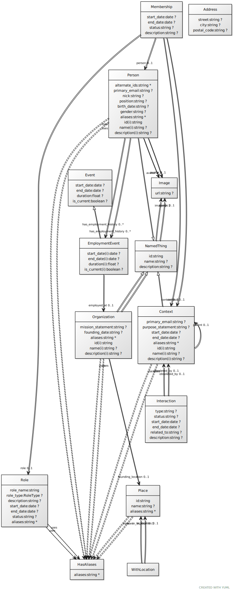

# rpoc Schema

This schema was initialy based on https://github.com/linkml/linkml/tree/main/examples/PersonSchema

An schema to collect/process Information about people, their roles together with orgainsational context based on [schema.org](http://schema.org), [Team Topologies](https://teamtopologies.com/) and [LinkML](https://linkml.io). For other examples, see the [linkml-registry](https://linkml.io/linkml-registry/registry/)

 * [rpoc.yaml](rpoc.yaml) -- schema source
 * [rpoc/](rpoc) -- derived files, created with `gen-project`
     * json-schema
     * owl
     * graphql
     * sql
     * ...
 * [data/](data) -- example data files
 * [build/](build) -- derived data files

## Schema diagram

generated via `gen-yuml rpoc.yaml -f svg -d .`:

https://github.com/public-value-tech/rpoc